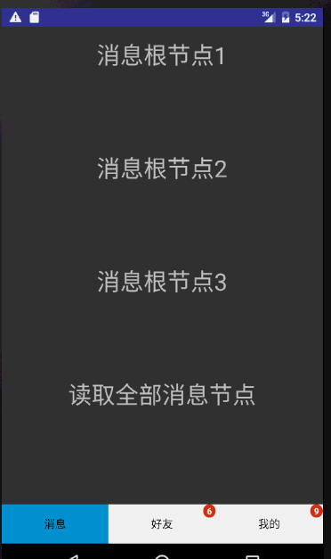

# SuperBadge - 超级角标
Message red dot count solution - 消息红点计数解决方案
 
* #####代码解析请跳转至我的简书，[《Android消息计数最终解决方案》](http://www.jianshu.com/p/35bbe15a42fc).
 
* #####[Demo下载](http://ac-nuiddhh1.clouddn.com/ad242ff781c7274bf711.apk).
 
 
 
 
 
###Add dependencies
------------------------------
 Add it in your root build.gradle at the end of repositories:
 
    allprojects {
        repositories {
            ...
            maven { url 'https://jitpack.io' }
        }
    }
 Step 2. Add the dependency
 
    dependencies {
        compile 'com.github.chendongde310:SuperBadge:0.0.2'
    }
  

### How to use
------------------------------------

* step1  初始化控件

           /**
             * 
             * @param context Activity
             * @param view 绑定角标view
             * @param tag 用于绑定的唯一标记
             * @param num 角标数字
             * @param show 是否显示数字
             * @return SuperBadgeHelper
             */
        SuperBadgeHelper.init(Activity context, View view, String tag, int num,boolean show)

* step2  绑定上级控件
    
        /**
          * 根据父级控件tag绑定父级控件
          * @param tag  父级控件的Tag
          */
          SuperBadgeHelper.bindView(String tag)
          //or
          SuperBadgeHelper.bindView(mSuperBadgeHelper)
          

* step3  设置已读

        /**
        * 读取所有消息，清空数字为0（不显示）
        */
        SuperBadgeHelper.read()
        
 
* other method
        
         //增加数字 - 必须为根节点控件 
         addNum(int i)
         //减少数字 - 必须为根节点控件 
         lessNum(int i)
         //是否显示角标
         setShowBadge(boolean b)
         //设置角标半径
         setDipRadius(int dipRadius)
         //设置角标颜色
         setBadgeColor(int badgeColor)
         
         
         
         